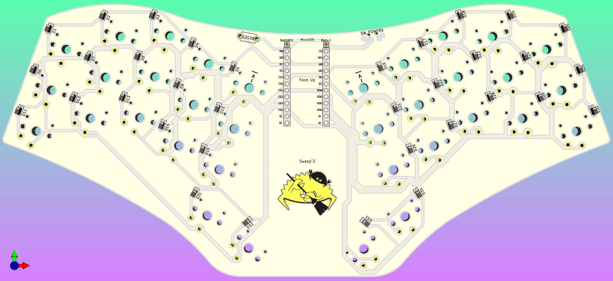

# Sweep Squared
 A unibody version of the Ferris Sweep split keyboard.
 
## Why?
The only reason I gave up on using the original Sweep is being able to comfortably use it on top of the laptop keyboard. Hopefully this one will work better.

## But it's just Zaphod
Yes. 

## Pics

  

Irl pic coming soon.

## Firmware
Will do soon, when free time :|

Both QMK and ZMK should be fairly trivial to make.
 
## Credits
Original Ferris is made by [pierrechevalier83](https://github.com/pierrechevalier83)

Ferris Sweep made by [davidphilipbarr](https://github.com/davidphilipbarr)

Symbols and footprints are credited below.

## Symbols and Footprints
Sources:

https://github.com/foostan/kbd

https://github.com/davidphilipbarr/Kicad-Footprints

https://github.com/ai03-2725/random-keyboard-parts.pretty

https://github.com/Biacco42/ProMicroKiCad

#### Also
ai03 pcb guide is super cool as well as ppl from the keeb discords.